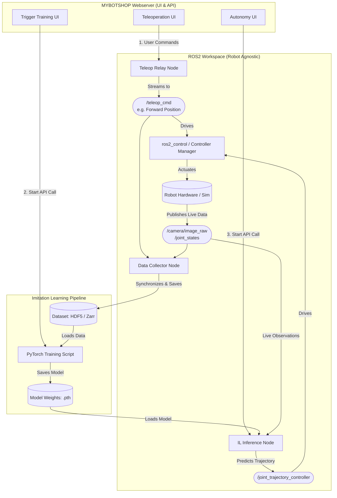

# mybotshop_Imitation_Hub
The **MYBOTSHOP Imitation Hub** is a proposed extension to the MYBOTSHOP robotic webserver platform. It provides an end-to-end pipeline where users can interact with their hardware via a clean UI, demonstrate tasks using teleoperation, and train the robot to perform those tasks autonomously.

### Key Features
* **Seamless Data Collection:** Synchronizes camera feeds and joint states during Web UI teleoperation.
* **Training Pipeline:** Converts recorded data into Behavior Cloning models upon triggering.
* **One-Click Autonomy:** Deploys trained neural networks back to ROS2 for real-time autonomous execution.
* **YAML-Driven Hardware Agnosticism:** Seamlessly switches between 6-DOF manipulators and mobile bases without altering Python source code.

# The Architecture of the Imitation Hub pipeline

# The Architecture overview:
The architecture of pipeline is designed to be highly modular and hardware-agnostic. By relying on standard ROS2 interfaces (sensor_msgs, trajectory_msgs), the pipeline can be attached to any robot.

We have 3 distinct phases:

**1. Data Collection:**

   * Trigger: The user initiates a recording session while teleoperating the robot via the Web UI. The UI sends actions to the robot's controller manager, and upon               execution, the /joint_states are updated.
   * Process: A custom ROS2 data_collector_node subscribes to the human's teleop commands, the robot's /joint_states, and the /camera/image_raw.
   * Storage:  Synchronized pairs are saved directly into HDF5 format with dynamic resizing (maxshape=None). (I would choose Zarr/HDF5 over standard rosbag2 because it allows for lightning-fast, parallelized dataloading in PyTorch).
    
    
**2. Training the Brain(Model):**

   * Trigger: The user clicks "Train Model" on the webserver, which sends an API call to the backend.
   * Process: A PyTorch training pipeline reads the HDF5 dataset. The task is framed as Behavior Cloning: the model takes an observation (Image + Current Joints) and learns      to predict the human's action (Target Joints).
   * Output: The script outputs weights file (.pth) obtained after training.

**3. Autonomous Execution:**

   * Trigger: The user selects the trained model and starts autonomy via the Web UI.
   * Process: The ROS2 inference_node is spun up. It loads the PyTorch model, subscribes to the live /camera/image_raw and /joint_states, passes them through the neural          network, and continuously publishes the predicted actions to the robot's /joint_trajectory_controller.

### Design Choices & Trade-offs
**Why a Manual Training Trigger instead of Automated Cron Jobs?**

While continuous integration and scheduled training (e.g., via cron jobs) are standard in traditional ML, Imitation Learning requires strict data quality control. Teleoperation data is inherently noisy (users make mistakes, drop objects, or pause). Providing a manual **"Trigger Training"** endpoint allows for Human-in-the-Loop validation—ensuring the user verifies the quality of the recorded demonstrations before initiating a compute-heavy GPU training process. It also provides immediate feedback, allowing users to train and test a specific task instantly rather than waiting for scheduled batch jobs.

**How's this architecture Hardware-agnostic?**

You will notice the architecture routes both `/teleop_cmd` and `/joint_trajectory_controller` through the `ros2_control` Manager. Teleoperation via the Web UI typically requires a streaming controller (like a Forward Position/Velocity Controller or MoveIt Servo) for responsive human input. Conversely, the Inference Node can predict action chunks and execute them smoothly via the `joint_trajectory_controller`, allowing the system to remain hardware-agnostic while ensuring safe, interpolated movements.To fulfill the requirement that this platform must work with different types of robots (humanoids, arms, mobile bases), hardcoding topic names and AI network dimensions is avoided. The entire pipeline is driven by a central ROS2 Parameter File (config/robot_params.yaml).

**Why State-Only MLP for Turtlesim?**

Turtlesim has no camera. The "image" from the bridge is a synthetic black canvas with a green dot — there is no meaningful visual information to extract. Using ResNet18 on a green dot would be using 11 million pretrained parameters to process a single pixel position. The pose [x, y, theta] already contains all the information perfectly. For a real arm with a camera, the architecture switches to ResNet18 + MLP (VisuomotorPolicy) which fuses visual features with joint state observations.
